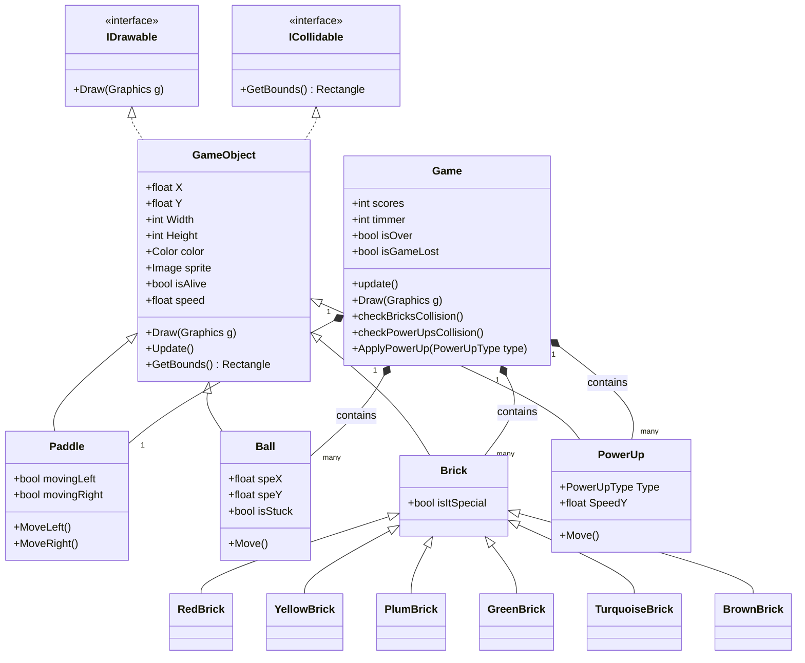

# Block Breaker - UML Domain Model

This file contains the UML Class Diagram for the game, structured using Mermaid.js syntax. Many modern markdown viewers (including GitHub and Visual Studio Code) support rendering this diagram automatically.

